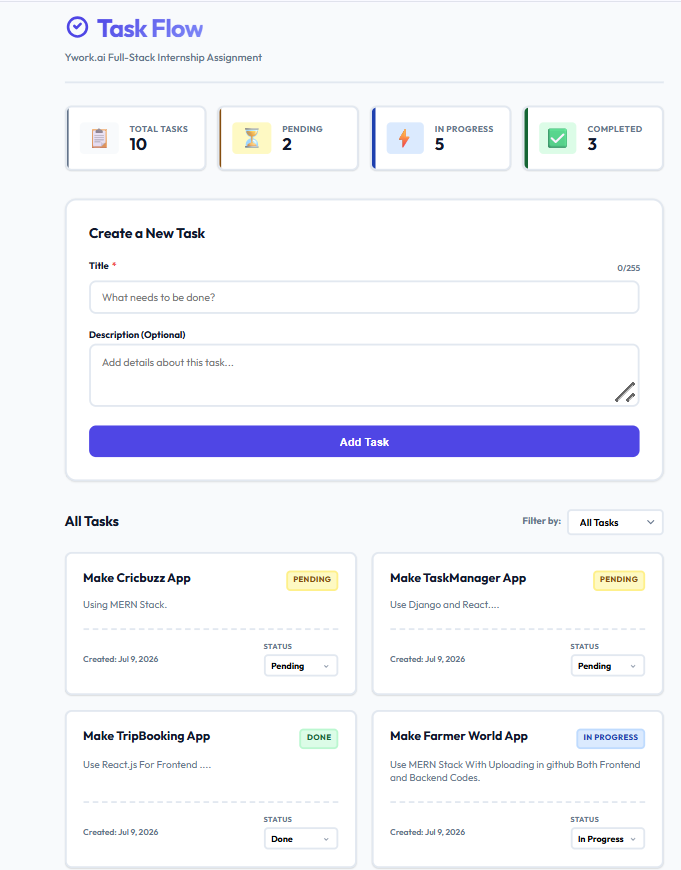
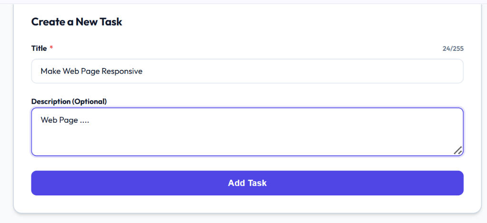
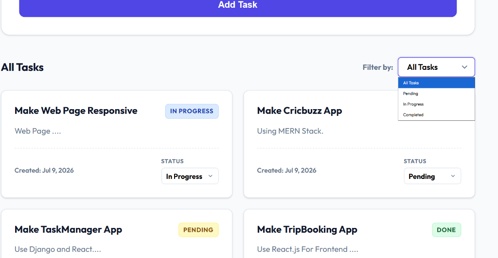

# Ywork Full Stack Assignment - Task Manager

This project is a simple Task Manager application built for the Ywork.ai Full Stack Developer hiring assignment. It consists of a Django API backend and a single-page React frontend.

---

## Screenshots

### Dashboard



### Create Task



### Filter Tasks



---

## Features

- **Create Tasks**: Add new tasks with a title and optional description.
- **View Tasks**: Lists all created tasks, ordered with the newest ones at the top.
- **Update Status**: Change task status (Pending, In Progress, Completed) via dropdown selectors. This updates the backend instantly using a PATCH API request.
- **Filter by Status**: Filter tasks using a status dropdown (All, Pending, In Progress, Completed). This calls the status query parameter endpoint on the backend.
- **Local Alerts**: Shows floating toast notifications for success and error events (like server connection issues or form errors).
- **Responsive Layout**: Adjusts to fit desktop, tablet, and mobile screen widths.
- **Skeleton Loaders**: Shows placeholder card loading grids while fetching tasks from the backend.

---

## Tech Stack

- **Backend**: Python 3.13+, Django 4.2, Django REST Framework (DRF), SQLite
- **CORS Config**: django-cors-headers
- **Frontend**: React (scaffolded with Vite), Axios, CSS
- **Database**: SQLite (local database file)

---

## Project Structure

```text
YWORK_TASK/
├── backend/                  # Django backend
│   ├── manage.py             # Django command line tool
│   ├── requirements.txt      # Python dependencies
│   ├── db.sqlite3            # SQLite database file (created on migrations)
│   ├── task_manager/         # Project configuration folder
│   │   ├── settings.py       # Configured with CORS, DRF, and app registries
│   │   ├── urls.py           # Main routing urls
│   │   └── ...
│   └── tasks/                # Tasks app folder
│       ├── models.py         # Task database model (title, description, status, created_at)
│       ├── serializers.py    # Serializers with title empty checks and status validation
│       ├── urls.py           # API routing rules for the TaskViewSet
│       ├── views.py          # ViewSet handling task listing, filters, and status updates
│       ├── management/
│       │   └── commands/
│       │       └── seed_tasks.py # Script to seed 5 default tasks
│       └── ...
│
├── frontend/                 # React frontend
│   ├── index.html            # Entry HTML (Imports Outfit and Inter fonts)
│   ├── package.json          # Node dependencies and scripts
│   ├── vite.config.js        # Hardcoded to run on port 3000
│   ├── src/
│   │   ├── main.jsx          # React app mounter
│   │   ├── App.jsx           # Main page component
│   │   ├── index.css         # Main stylesheet (layout, transitions, colors)
│   │   ├── services/
│   │   │   └── api.js        # Axios API requests helper (targets port 8000)
│   │   └── components/
│   │       ├── TaskForm.jsx  # Form to submit new tasks (with character counter)
│   │       ├── TaskList.jsx  # Grid layout for tasks
│   │       ├── TaskCard.jsx  # Card view with immediate status dropdown
│   │       ├── TaskFilter.jsx# Filter dropdown selector
│   │       ├── SkeletonLoader.jsx # Pulsating placeholders for loading state
│   │       └── Toast.jsx     # Floating notification alert items
│   └── dist/                 # Frontend production build output
│
└── .gitignore                # Excludes virtual environments and dependencies from git
```

---

## Local Setup

Make sure you have **Python 3.10+** and **Node.js 18+** installed.

### 1. Django Backend Setup

Open a terminal, go to the `backend` folder, and set up your virtual environment:

```bash
# Go to backend folder
cd backend

# Create virtual environment
python -m venv venv

# Activate virtual environment
# Windows (PowerShell):
.\venv\Scripts\Activate.ps1
# Windows (CMD):
.\venv\Scripts\activate.bat
# macOS/Linux:
source venv/bin/activate

# Install requirements
pip install -r requirements.txt

# Run database migrations
python manage.py makemigrations
python manage.py migrate

# Seed database with the 5 default tasks
python manage.py seed_tasks

# Run backend development server (runs on http://localhost:8000)
python manage.py runserver
```

### 2. React Frontend Setup

Open a second terminal window, go to the `frontend` folder, and start the development server:

```bash
# Go to frontend folder
cd frontend

# Install packages
npm install

# Run frontend development server (runs on http://localhost:3000)
npm run dev
```

Open **[http://localhost:3000](http://localhost:3000)** in your browser to view the application.

---

## API Documentation

All API endpoints are prefixed with `/api/`.

| Method | Endpoint | Description | Request Body / Query Params | Status Codes |
| :--- | :--- | :--- | :--- | :--- |
| **GET** | `/api/tasks/` | Retrieve all tasks, sorted by newest. | None | `200 OK` |
| **GET** | `/api/tasks/?status=<val>` | Retrieve filtered tasks. | `?status=pending`, `?status=in_progress`, or `?status=done` | `200 OK`<br>`400 Bad Request` *(on invalid status)* |
| **POST** | `/api/tasks/` | Create a new task. | `{ "title": "String", "description": "Optional" }` | `201 Created`<br>`400 Bad Request` *(on empty title)* |
| **PATCH** | `/api/tasks/<id>/` | Update a task's status. | `{ "status": "in_progress" }` | `200 OK`<br>`400 Bad Request` *(on invalid status)* |

---

## Sample Request & Response Payloads

### 1. Create a Task (POST `/api/tasks/`)

- **Request Body**:
  ```json
  {
    "title": "Build React Frontend",
    "description": "Develop a single-page React dashboard and link to Django."
  }
  ```

- **Response (`201 Created`)**:
  ```json
  {
    "id": 6,
    "title": "Build React Frontend",
    "description": "Develop a single-page React dashboard and link to Django.",
    "status": "pending",
    "created_at": "2026-07-09T14:32:00.123456Z"
  }
  ```

- **Response (`400 Bad Request` - Title Empty)**:
  ```json
  {
    "title": [
      "Title cannot be empty."
    ]
  }
  ```

---

### 2. Filter Tasks by Status (GET `/api/tasks/?status=in_progress`)

- **Response (`200 OK`)**:
  ```json
  [
    {
      "id": 3,
      "title": "Develop React SPA Frontend",
      "description": "Set up Vite with React, design CSS dashboard UI, and build TaskForm and TaskList components.",
      "status": "in_progress",
      "created_at": "2026-07-09T14:06:30.123456Z"
    }
  ]
  ```

- **Response (`400 Bad Request` - Invalid Status Parameter)**:
  ```json
  {
    "status": "Invalid status 'invalid'. Status must be one of: pending, in_progress, done."
  }
  *Note: The viewset returns a validation error response if the status query parameter is not valid.*
  ```

---

### 3. Update Task Status (PATCH `/api/tasks/3/`)

- **Request Body**:
  ```json
  {
    "status": "done"
  }
  ```

- **Response (`200 OK`)**:
  ```json
  {
    "id": 3,
    "title": "Develop React SPA Frontend",
    "description": "Set up Vite with React, design CSS dashboard UI, and build TaskForm and TaskList components.",
    "status": "done",
    "created_at": "2026-07-09T14:06:30.123456Z"
  }
  ```

---

## Validation & Business Rules

- **Title Constraints**:
  - Title cannot be empty (enforced by serializers and frontend validations).
  - Maximum character length is 255.
- **Status Constraints**:
  - Task status can only be `pending`, `in_progress`, or `done`.
  - The API ViewSet verifies query string status parameters, returning a `400 Bad Request` with an error message if an invalid status is sent.

---

## Architectural Decisions

1. **Port Mappings**: The React frontend runs on port 3000 and points directly to port 8000 for backend API requests. No extra environment variable configuration is needed.
2. **CORS Configuration**: The `django-cors-headers` package is used to allow requests from the React frontend running on `http://localhost:3000`.
3. **Database Seeding**: The custom management command `seed_tasks` resets the database and creates 5 sample tasks, making it easy to test the application with pre-populated data.
4. **Styling and CSS**: We used vanilla CSS with CSS variables (custom HSL values) and standard flexbox/grid layouts. This keeps the application fast and lightweight without relying on CSS frameworks.
5. **Accessibility**: We added clear outlines using `:focus-visible` to support keyboard navigation.
